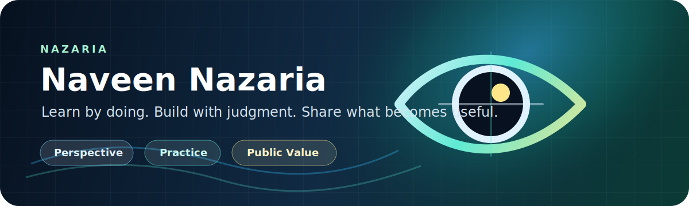

  

  
  
  

# Naveen Nazaria

**Nazaria** means perspective: a way of looking at a problem from the user's side, the institution's side, and the messy real-world side before deciding what to build.

I am learning by doing. When I do not know something, I start small, build the first version, read the failure honestly, and improve from there. I have benefited from open-source kits, public explainers, examples, and people who shared their work before me. This GitHub is becoming my own contribution back: a practical workbench of products, prototypes, notes, and reusable learning trails.

## My Build Lens

| Lens | What It Means In Practice |
| --- | --- |
| **Seva and public purpose** | Do the work sincerely, keep people at the centre, and make systems easier to trust. |
| **Problem-first thinking** | Acknowledge what is not working, learn what is missing, and move toward a practical solution. |
| **Technology with judgment** | Use technology where it improves access, privacy, execution, institutional capability, or citizen experience. |
| **Learning in public** | Turn experiments into useful kits, explainers, and patterns that others can build on. |

## Current Directions

  
  
  
  
  

- **Digital public systems** shaped by GSTN, taxpayer experience, service delivery, and large-scale implementation.
- **GST and e-invoice learning material** that can become clearer, verified, and easier for others to use.
- **Local-first AI tools** where privacy, usefulness, and control matter.
- **Builder notes and small prototypes** that turn uncertainty into working examples.

## Public Workbench

| Project | Why It Exists |
| --- | --- |
| [FullSnap Extension](https://github.com/Najariya/fullsnap-extension) | A local Chrome extension for screenshot capture, annotation, export, and privacy-first utility. |
| [Secure OTP App](https://github.com/Najariya/secure-otp-app) | A prototype for thinking through safer OTP and security workflows. |
| [FullSnap Prototype](https://github.com/Najariya/FullSnap) | Early screenshot and annotation experiments before the clearer extension path emerged. |

Some active product work stays private until it is useful, documented, and safe to share.

## Working Policy

- Keep private work private until there is a clear reason to publish.
- Label prototypes honestly so experiments do not pretend to be finished products.
- Prefer source evidence, runbooks, tests, and real system output over confident guesses.
- Share what becomes reusable: kits, patterns, checklists, and explainers.
- Use AI as an execution partner, while keeping human judgment responsible for public identity, credentials, product direction, and sensitive decisions.

## Website

The longer public profile lives at [naveenagrawal.in](https://naveenagrawal.in).

